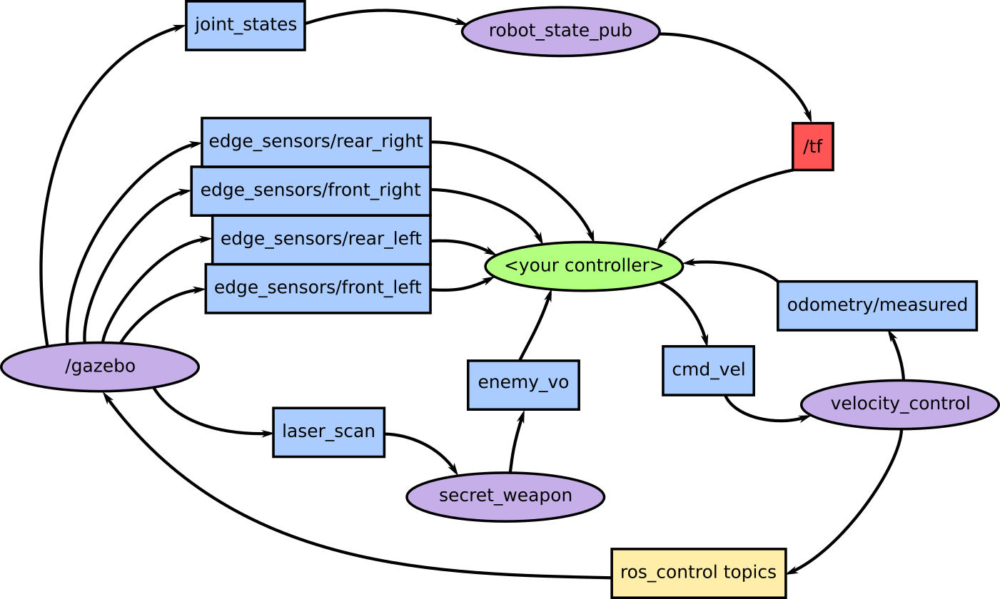
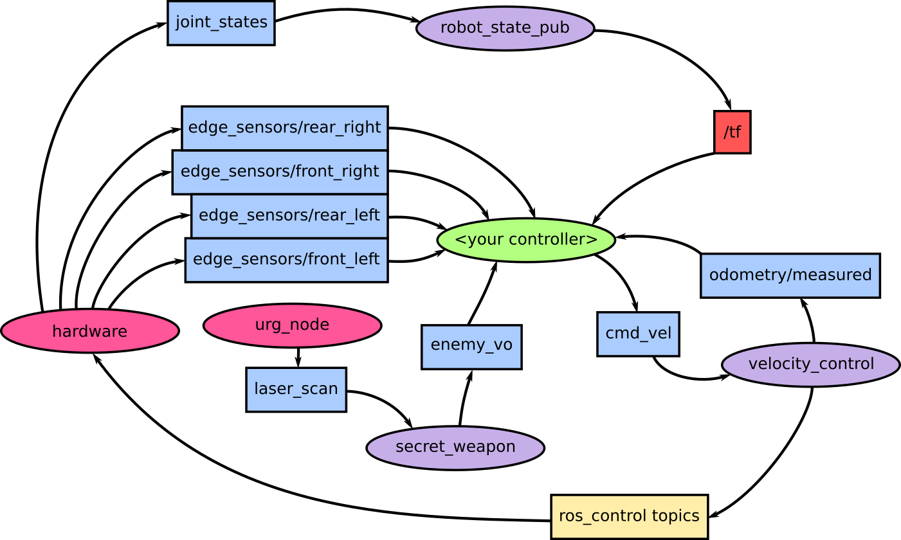

# Romania-Sumobot
Cheryl, Nick, Terence and Victor's robot for Robochallenge Mega Sumo in Romania

## Robot Name - InterFEARence

## Packages

### interfearence_controllers
Contains all the sub packages for the interfearence controllers. Controllers should be put in a package called interfearence_controllers\_<name>. See below for info about creating a new controller.

### interfearence-launch
Launch files

### interfearence-hardware
Hardware interface node
- Motor control
- Sensor control

Velocity control node
- convert command vel to target wheel vels
- convert measured wheel vels to odometry

### interfearence-localisation
Odometry etc.

**Currently empty and un-used**

### interfearence-secret-weapon
Lidar data processing

### interfearence-description
Robot description files (e.g. URDF,SDF)

### interfearence-gazebo
Gazebo simulation models, plugins and launch files

## Creating a Controller

### IMPORTANT NOTE - Also subscribe to /reset (std_msgs/Bool). If this is set to True then you need to reset the controller to its initial state. This is to allow for easy resetting of simulation etc.

One of the reasons behind using ROS for this robot is to allow simulation and testing of many different algorithms and tactics, ideally without rewriting the entire code base each time. As such, only one node should have to change between different tactical controllers. This is the controller node and the more different controllers we have the better.



The above diagram shows the current ROS network for a single robot in simulation. All nodes and topics without a leading slash will be in a robot namespace to avoid (non-simulated) clashes with other robots in the same simulation. This shows what topics are available to subscribe to for any controller - you do not necessarily need to subscribe to all of them!

A brief description of each topic follows:

 - *cmd_vel* - The target velocity of the base of the robot. x is forwards. This is _REQUIRED_ as otherwise the robot won't move! Message type is geometry_msgs/Twist.
 - *enemy_vo* - The secret weapon attempts to estimate the enemy position and velocity and publishes this on this topic. The message type is nav_msgs/Odometry. Currently only does position well as it doesn't account for our relative movement.
 - *edge_sensors/x* - There are 4 of these topics, corresponding to the 4 edge detection sensors on the robot. These are of type interfearence_msgs/EdgeDetection, which required the interfearence_msgs package to be built first. If `at_edge` is true then that respective sensor has detected the edge of the arena.
 - *odometry/measured* - The velocity controller also measures wheel velocity to calculate our robots real motion rather than what we're telling it to do. This includes an estimation of our position relative to where we started.This does _not_ account for any wheel slip though... Message type is nav_msgs/Odometry.
 - *tf* - Obviously we have access to tf. This includes our position relative to the odometry frame, as well as the positions of our sensors etc. Note that everything is prefixed by the *tf_prefix* parameter.

Now clearly the diagram above shows the robot in a simulation environment. What about reality? The diagram below shows the real robot node graph.



Note that the _/gazebo_ node has been replaced with a _hardware_ node and an *urg_node* node. The latter runs the laser scanner, while the former runs everything else hardware related. Importantly, *your controller interface does not change*. So everything works the same way!

## Testing Your New Controller

Once you've created your package you will need to test it. The best way to do this is against the simple rushing robot. 

### Manually

To begin with, you probably want to check that the code does approximately what you want it to do and doesn't crash. Run the following command to launch a simulation with two robots against each other:

`roslaunch interfearence-gazebo one_v_one.launch controller_2:=rush_b`

One of the robots will not yet have a controller. This robot is in the namespace *test_bot_1*. Open a new terminal and run the following commands:

```
export ROS_NAMESPACE=test_bot_1
rosrun <your_package_name> <your_node_name> <insert args here if any>
```

Now hit run on the simulation and hopefully it will work!

### Launch file

If you're tired of the above, or want to let the rest of us use your controller then you'll need to add it to the launch file. Open up interfearence-gazebo/launch/spawn_robot.launch and add a name for your controller to the list in the comment (starting line 4). Find the section titled _Spawn the chosen controller_ where there are a bunch of <group if> statements.

It should be fairly intuitive, copy the syntax used there to launch your controller. Once this is done you can launch a one v one as usual, but remapping one (or both) of the controllers to your new one!
